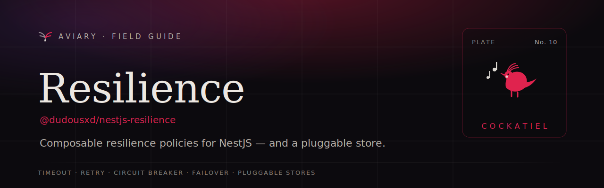

<p align="center">
  <a href="https://davidecarvalho.github.io/aviary/docs/resilience">
    
  </a>
</p>

<p align="center">
  <b><a href="https://davidecarvalho.github.io/aviary/docs/resilience">📖 Read the documentation</a></b>
  &nbsp;·&nbsp; part of the <a href="https://davidecarvalho.github.io/aviary/"><b>Aviary</b></a> ecosystem for NestJS
</p>

---

# nestjs-resilience

A NestJS-native resilience toolkit — composable **timeout**, **retry**, **circuit breaker**, and
**failover** policies, with a pluggable, distributed circuit-breaker store. Think *cockatiel for
NestJS*, wired into the ecosystem's conventions (diagnostics, context, event-emitter).

```ts
import { wrap, timeout, retry, circuitBreaker, InMemoryResilienceStore } from '@dudousxd/nestjs-resilience';

const policy = wrap(
  timeout(2_000),
  retry({ attempts: 3, backoff: exponential() }),
  circuitBreaker({ key: 'payments', store: new InMemoryResilienceStore(), threshold: 5, cooldownMs: 30_000 }),
);

await policy.execute(() => chargeCard(order)); // timeout → retry → breaker, composed outer→inner
```

Three ways to use it: the **programmatic** policies above, **`@Timeout` / `@Retry` / `@CircuitBreaker`
decorators** (wrapped at startup by a `DiscoveryService` explorer), and an injectable
**`ResilienceService`** via `ResilienceModule.forRoot()`. State transitions emit over
[`@dudousxd/nestjs-diagnostics`](https://davidecarvalho.github.io/aviary/docs/diagnostics) on the
`aviary:resilience:*` channel and, optionally, an `@nestjs/event-emitter` mirror.

## Packages

| Package | Description |
| --- | --- |
| [`@dudousxd/nestjs-resilience`](./packages/core) | The policy engine (timeout/retry/circuit-breaker/wrap/failover), the `ResilienceStore` contract, an in-memory store, and the NestJS surfaces (module, service, decorators). |
| [`@dudousxd/nestjs-resilience-store-redis`](./packages/store-redis) | Distributed circuit-breaker store on Redis (atomic Lua admit/record). |
| [`@dudousxd/nestjs-resilience-store-typeorm`](./packages/store-typeorm) | Distributed store on Postgres via TypeORM (`SELECT … FOR UPDATE`). |
| [`@dudousxd/nestjs-resilience-store-mikro-orm`](./packages/store-mikro-orm) | Distributed store on Postgres via MikroORM. |
| [`@dudousxd/nestjs-resilience-store-prisma`](./packages/store-prisma) | Distributed store on Postgres via Prisma. |
| [`@dudousxd/nestjs-resilience-store-drizzle`](./packages/store-drizzle) | Store on SQLite via Drizzle (better-sqlite3). |

Every store passes the same shared contract (`runResilienceStoreContract`, exported from
`@dudousxd/nestjs-resilience/testing`) — the distributed ones are validated against real engines with
testcontainers, including the concurrency invariant: exactly one half-open probe under load.

## Install

```bash
pnpm add @dudousxd/nestjs-resilience
# fleet-wide breaker state? add a distributed store, e.g.:
pnpm add @dudousxd/nestjs-resilience-store-redis ioredis
```

`@nestjs/common` and `@nestjs/core` are peer dependencies; `@dudousxd/nestjs-diagnostics`,
`@dudousxd/nestjs-context`, and `@nestjs/event-emitter` are optional, soft-detected integrations.

## License

MIT
